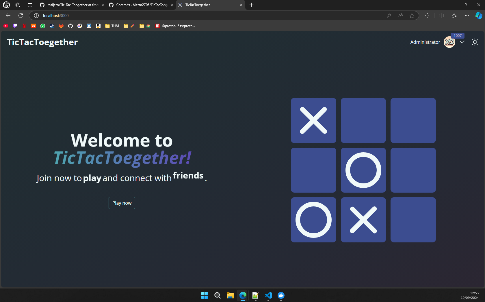
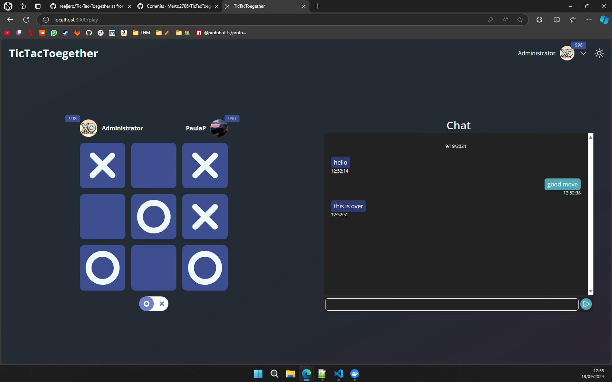
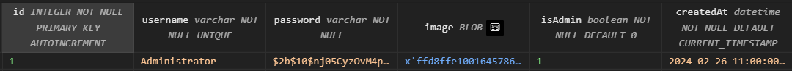

# Tic Tac Together

`Mert Ali Özmeral, Sebastian Adam Heinrich Knauf, Eike Torben Menzel & Jerome-Pascal Habanz`

<div style="display: flex">
    
    
</div>

## Getting started

### Local Development

To begin local development, follow these steps for both the _./app/backend_ and _./app/frontend_ directories:

1. **Install dependencies by running the command in** _./app/backend_ **and** _./app/frontend_ **directory:**

   ```bash
   npm i
   ```

2. **For the frontend, navigate to the** _./app/frontend_ **directory and initiate the build process with live updates:**

   ```bash
   npm run build -- --watch
   ```

3. **Open another shell window and proceed to the** _./app/backend_ **directory:**
4. **Start the backend server in development mode:**

   ```bash
   npm run start:dev
   ```

Now TicTacToegether should be up and running on http://localhost:3000

### Local Production

To begin local production, follow these steps for both the _./app/backend_ and _./app/frontend_ directories:

1. **Install dependencies by running the command in** _./app/backend_ **and** _./app/frontend_ **directory:**

   ```bash
   npm i
   ```

2. **For the frontend, navigate to the** _./app/frontend_ **directory and initiate the build process:**

   ```bash
   npm run build
   ```

3. **Proceed to the** _./app/backend_ **directory:**
4. **Start the backend server in production mode:**

   ```bash
   npm run build
   npm run start:prod
   ```

Now TicTacToegether should be up and running on http://localhost:3000

### Local Docker

1. **Head to the** _./app_ **directory and run the following commands to start build and start the image:**
   ```bash
   docker build -t tictactoegether .
   docker run -p 3000:3000 tictactoegether
   ```

Now TicTacToegether should be up and running on http://localhost:3000

## User Data

### Initial

<table>
    <thead>
        <tr>
            <td>Username</td>
            <td>Password</td>
        </tr>
    </thead>
    <tbody>
        <tr>
            <td>Administrator</td>
            <td>adminPassword123!</td>
        </tr>
        <tr>
            <td>PaulaP</td>
            <td>Wasd123!</td>
        </tr>
        <tr>
            <td>Kamala</td>
            <td>Kamala123!</td>
        </tr>
        <tr>
            <td>Stefan</td>
            <td>Stefan123!</td>
        </tr>
    </tbody>
</table>

### Add User as Administrator

Open _database.sqlite_ and add the isAdmin flag as shown below:

